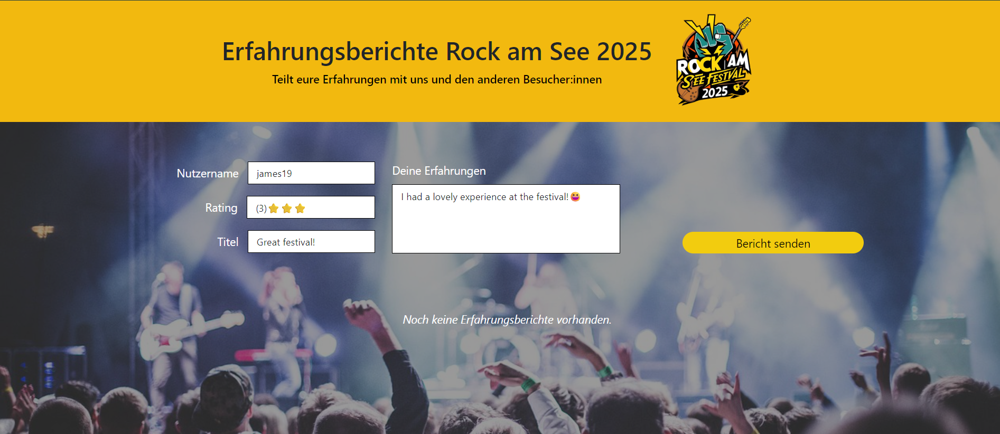
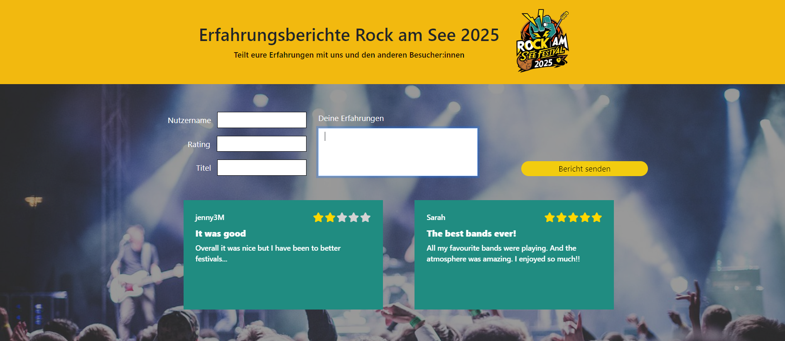

# T04 Festival Experience Reports (Web Technologies)

### Project Preview

  
  

## Context
This project was the final milestone within the "Web Technologies" module. The objective was to utilize a modern JavaScript framework—Svelte 5—to build a robust Single-Page Application (SPA). This milestone focused on state management, component-based architecture, and integrating external CSS frameworks like Bootstrap for responsive design.

## Description
The "Rock am See – Experience Reports" application allows festival visitors to share and view personal experience reports.
Key features include:
- Interactive Form: Users can submit feedback (username, title, message) with a star-rating system.
- Local Persistence: Reports are stored in the browser’s localStorage, ensuring data is retained across sessions.
- Dynamic UI: Submitted reports are displayed as a responsive grid of cards, featuring visual star-rating representations.
  
## Technologies Used
- Framework: Svelte 5
- Styling: Bootstrap
- Build Tool: Vite
- Storage: Browser localStorage
- Language: JavaScript (ES6+)

## Folder Structure
- /src: Application source code (Svelte components, logic)
- /public: Static assets
- package.json: Project dependencies and scripts
- README.md: This documentation

## Setup Instructions
1. Ensure Node.js (v18+) is installed.
2. Download and unzip the project folder.
3. Open the directory in your IDE.
4. Install dependencies: npm install
5. Start the development server: npm run dev
6. Open your browser and navigate to http://localhost:5173. Enjoy! 😊

## Testing
The application was tested on Brave Browser, Firefox and Chrome.
